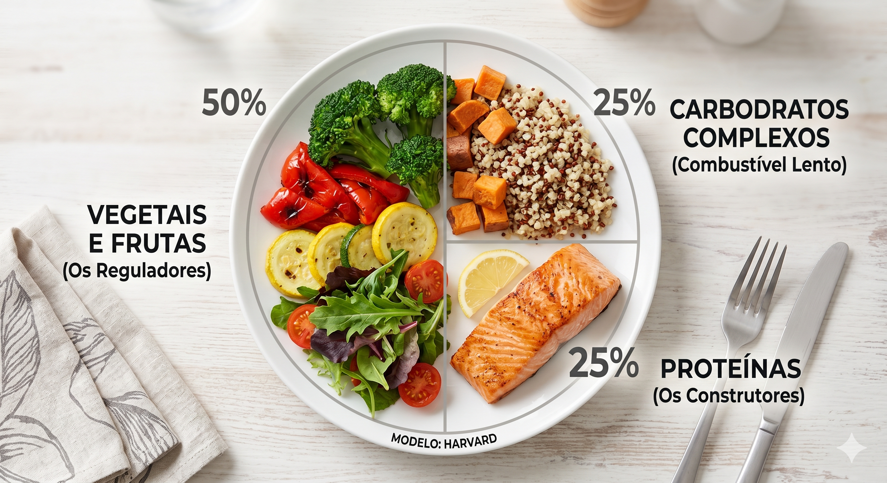
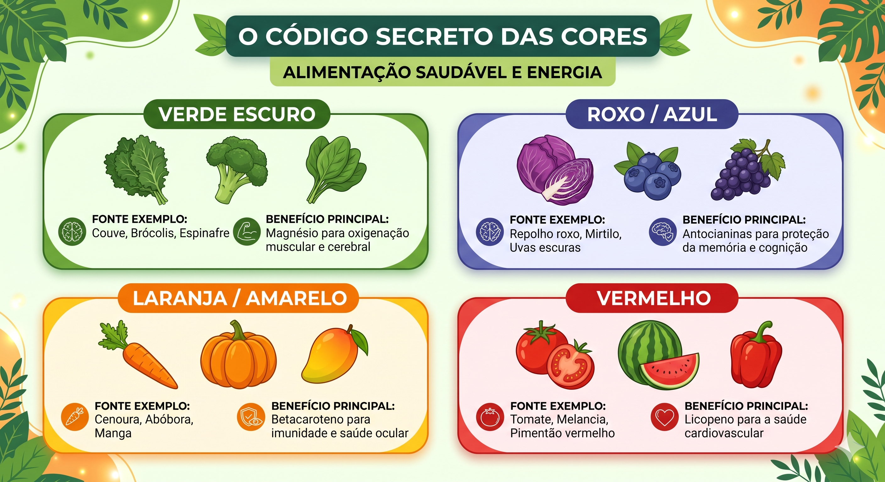
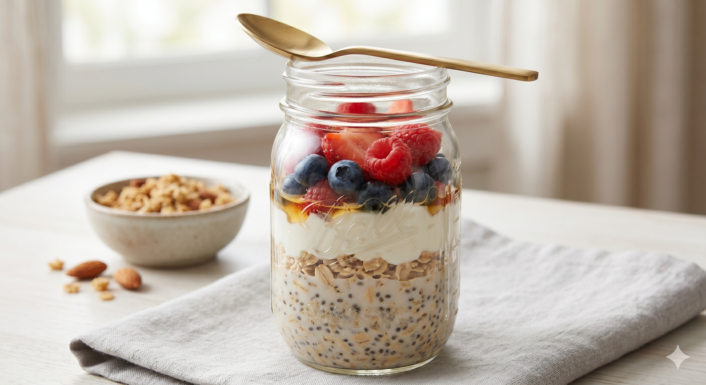

# ia-generativa-blog-saude
Projeto de criação de conteúdo estratégico utilizando IA Generativa, unindo pesquisa acadêmica, nutrição e marketing.

---

# Projeto: Blog Post Estratégico com IA Generativa 🚀

Este repositório contém a documentação e o resultado final de um post de blog sobre alimentação saudável, desenvolvido como parte da formação em IA da Alura. O diferencial deste projeto é a aplicação de **Engenharia de Prompts** e **Mecanismos de Pesquisa** avançados.

## 🛠️ Metodologia e Estruturação
Como estudante universitário, utilizo a IA diariamente para organizar pensamentos complexos e validar dados de pesquisa. Para este projeto, apliquei essa mesma lógica acadêmica para garantir que a IA não fosse apenas um gerador de texto, mas uma ferramenta de curadoria técnica.

### Passo a Passo da Construção:
1. **Estabelecimento de Persona (Roleplay):** Definição da IA como um Nutricionista Especialista para garantir autoridade no conteúdo.
2. **Framework de Marketing:** Aplicação da estrutura da RD Station (Escaneabilidade, Introdução com Gancho e CTA).
3. **Grounding (Fundamentação):** Uso de mecanismos de busca para basear o post em fontes reais, como o *Healthy Eating Plate* de Harvard e o *Guia Alimentar para a População Brasileira*.
4. **Iteração e Refinamento:** O texto foi construído em camadas, aprofundando conceitos de **Fitonutrientes** e **Estabilidade Glicêmica**.
5. **Multimodalidade:** Geração de ativos visuais (imagens e infográficos) para complementar a experiência de leitura.

---

## 📝 O Post: Além do Básico: Como a Composição do seu Prato Transforma sua Energia

**Resumo:** *Entenda por que o segredo da produtividade e do bem-estar não está em dietas restritivas, mas na estratégia das cores e na combinação inteligente de nutrientes.*

---

### Introdução: O Combustível por trás do Foco
Você já sentiu que, mesmo dormindo bem, sua energia "desaparece" no meio da tarde? Ou que o foco nos estudos e no treino parece impossível após o almoço?

Muitas vezes, buscamos a resposta em cafés extras ou energéticos, mas o verdadeiro ajuste está na **composição do seu prato**. Como nutricionista, vejo que o erro comum não é o "que" se come, mas a falta de equilíbrio entre os grupos alimentares. Alimentação saudável não é sobre privação; é sobre fornecer a informação bioquímica correta para o seu corpo performar no topo.

---

### 1. A Geometria da Energia: A Regra do Prato Ideal
Para manter o nível de açúcar no sangue estável e evitar o famoso "nevoeiro mental", precisamos de uma divisão estratégica. O modelo abaixo, baseado na Universidade de Harvard, é o padrão ouro para quem busca disposição constante:

*   **50% - Vegetais e Frutas (Os Reguladores):** Metade do seu prato deve ser vibrante. Eles fornecem as fibras que controlam a velocidade da energia.
*   **25% - Carboidratos Complexos (O Combustível Lento):** Raízes, tubérculos ou grãos integrais. Eles liberam glicose de forma gradual, mantendo você saciado por mais tempo.
*   **25% - Proteínas (Os Construtores):** Essenciais para a recuperação muscular e para a produção de neurotransmissores que mantêm a mente alerta.

> **Legenda:** A divisão 50/25/25 é a base para uma glicemia estável e foco prolongado.
> 

---

### 2. O Código Secreto das Cores (Fitonutrientes)
As cores não servem apenas para deixar o prato bonito no Instagram. Elas indicam a presença de **fitonutrientes**, compostos que protegem suas células contra o estresse oxidativo causado pela rotina intensa.

> **Legenda:** Resumo visual de como as cores dos alimentos impactam sua energia e foco.
> 

---

### 3. O "Pulo do Gato": Índice Glicêmico e Gorduras Boas
Um prato de arroz branco com frango pode parecer saudável, mas ele carece de "freios". Sem fibras ou gorduras boas, o carboidrato vira açúcar rápido demais, gerando um pico seguido de uma queda brusca de energia.

**Dica Nutri:** Sempre adicione uma fonte de gordura boa (azeite extravirgem, sementes ou abacate) e fibras. Isso garante que a energia do seu almoço dure até o jantar, sem altos e baixos.

---

### 4. Receitas Essenciais para sua Rotina

#### Café da Manhã: Overnight Oats de Performance
*Prepare na noite anterior e ganhe 15 minutos extras de sono.*
*   **Ingredientes:** 3 colheres de sopa de aveia, 1 colher de sopa de chia, 100ml de leite vegetal (ou iogurte), frutas vermelhas e um fio de mel.
*   **Por que funciona:** A chia e a aveia formam um gel que retarda a digestão, entregando energia estável para as primeiras horas de trabalho ou estudo.

> **Legenda:** Pote de Overnight Oats preparado com aveia, chia e frutas vermelhas.
> 

#### Almoço/Jantar: O Bowl Vibrante
*   **Base:** Quinoa ou arroz negro cozido com cúrcuma (poderoso anti-inflamatório).
*   **Cores:** Brócolis ao vapor, cenoura ralada e repolho roxo picadinho.
*   **Proteína:** Filé de peixe grelhado ou grão-de-bico temperado com páprica.
*   **Toque Final:** Sementes de girassol para crocância e gordura boa.

---

### Conclusão: Pequenas Mudanças, Grandes Impactos
A alimentação saudável não precisa ser monótona. Ao entender que cada cor e cada grupo alimentar tem uma função específica na sua performance, você deixa de "fazer dieta" e passa a "nutrir resultados". Comece hoje: adicione uma cor nova no seu próximo prato e observe sua disposição mudar.

**E aí, qual cor está faltando no seu prato hoje?** Deixe seu comentário abaixo e compartilhe sua combinação favorita!

---

## 🎨 Ativos Visuais
As imagens abaixo foram geradas por IA para ilustrar os conceitos do post e estão armazenadas neste repositório:

* **Divisão do Prato Ideal (Seção 1):** `prato.png`
* **O Código Secreto das Cores (Seção 2):** `codigo_cores.png`
* **Café da Manhã de Performance (Seção 4):** `aveia.png`

---

## 📚 Referências Científicas e Técnicas Utilizadas
- [Harvard T.H. Chan - Healthy Eating Plate](https://nutritionsource.hsph.harvard.edu/healthy-eating-plate/)
- [Ministério da Saúde - Guia Alimentar para a População Brasileira](https://bvsms.saude.gov.br/bvs/publicacoes/guia_alimentar_populacao_brasileira_2ed.pdf)
- [RD Station - Guia de Escrita para Blog](https://www.rdstation.com/blog/marketing/como-escrever-para-blog/)
- [PubMed/Nutrients - Diet and Cognitive Function Study](https://www.ncbi.nlm.nih.gov/pmc/articles/PMC7322666/)
